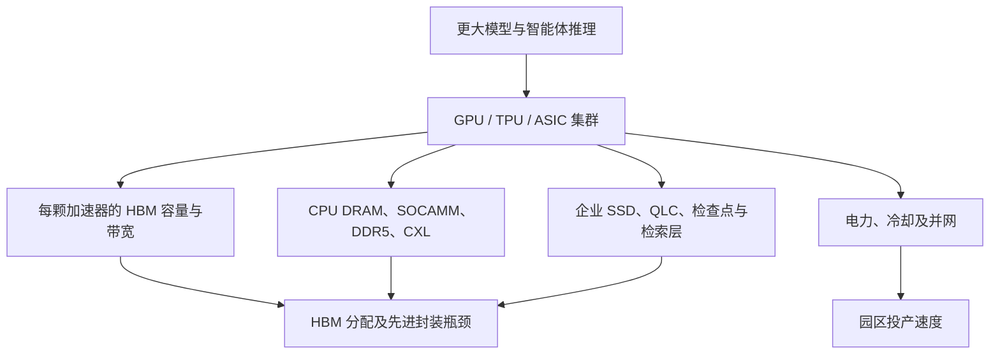

# AI 数据中心需求：算力扩张如何拉动 HBM、DRAM、NAND、CXL 与电力

> [查看英文原文](../../10-macro-drivers/01-ai-datacenter-demand.md)

AI 数据中心是当前存储周期最重要的宏观驱动力：模型规模、推理流量和云厂商竞争会被转化成一套刚性的物料清单。需求单位不再只是单条服务器 DIMM 或客户端 SSD，而是机架乃至园区级的“AI 工厂”：加速器、HBM 堆叠、CPU 内存、CXL 扩展内存、企业级 SSD、网络、液冷、变压器、开关设备和购电合同相互耦合。微软预计 FY2025 为 AI 数据中心投入约 800 亿美元；Stargate 则提出四年 5,000 亿美元的美国 AI 基础设施计划。它们不等于存储收入，却解释了供应商为何把晶圆、封装产能及客户谈判优先转向 AI。

关键建模变化是：AI 资本开支同时受多项串行瓶颈约束。GPU 有货而 HBM 不足，加速器就无法出货；HBM 到位而类 CoWoS 封装、老化筛选或已知良好芯粒（KGD）测试滞后，机架仍会延期；机架就绪但变压器或并网受阻，园区也不能投产。IEA 估计全球数据中心投资自 2022 年以来几乎翻倍，2024 年约为 5,000 亿美元；数据中心用电约 415 TWh，2030 年可能升至约 945 TWh。存储需求因此取决于实体基础设施交付，而不仅是模型热度。

## 需求堆栈

需求从加速器封装开始。NVIDIA 的 GB200 NVL72 是液冷机架级系统，包含 72 个 Blackwell GPU、36 个 Grace CPU 和约 30 TB 高速内存。它说明 HBM 是“利用率保险”：昂贵的张量核心不能因带宽不足闲置，客户愿为足够的容量与带宽付费。平台发布一旦被云厂商采用，就会放大为多个采购计划。

平台内存附着率在代际间变化很大。以 Vera Rubin 为例，36 GB 12 层 HBM4、48 GB 16 层 HBM4、SOCAMM2 及 PCIe Gen6 SSD 同时进入产品路线，信号并非只有 HBM，而是 CPU 邻近低功耗内存和高吞吐存储都被拉动。HBM 需求具非线性：每封装的堆叠数、每堆容量和平台出货量相乘；从 8 个位置改为 12 个、或提高层数，都会在最终工作负载不变时显著增加 DRAM die、组装和散热需求。

## 超大规模云、Neocloud 与预订行为

云厂商把 AI 基础设施视作战略投入，不是普通云容量。预先锁定采购协议、认证排期和交付窗口，会在服务收入实现前就对存储供给施压。Neocloud 和定制托管商也会放大影响：它们转售训练与推理算力，最终消耗同样的 HBM、服务器 DRAM、SSD、光模块、供电和冷却。

预订是资本开支与存储价格之间的桥梁。若运营商认为 GPU 舰队的变现受 HBM 供应限制，预订 HBM 就是在保护更大规模的机架投资。由此，能证明良率、堆叠高度、热性能、平台认证和交付可靠性的存储厂商拥有更强议价能力。

## 推理改变内存组合

训练带来第一波投资，推理则改变组合。训练可批处理、可远程部署，主要受大型集群支配；推理加入低延迟、突发流量、地域分布、KV cache、检索和 SLA。长上下文及智能体工作流还保存会话状态、中间工具输出和检索内容。

因此 AI 内存不止 HBM。HBM 放置带宽敏感的张量与热 KV 状态；CPU DRAM、SOCAMM 与 CXL 容纳编排、主机缓存和较温状态；企业 SSD/QLC 存放检查点、嵌入、向量数据库、训练语料、模型分片与持久缓存。分层内存可能把部分压力从本地 HBM 移开，但也会使更大服务上下文变得经济，从而同时拉动 CXL 和 SSD。

| 数据层 | 常见介质 | 主要权衡 |
|---|---|---|
| 热状态 | HBM | 最低延迟、最高带宽、成本高 |
| 温状态 | CPU DRAM / SOCAMM / CXL | 容量扩展与可接受延迟 |
| 冷状态 | 企业 SSD / QLC / 对象存储 | 持久性、成本与更高延迟 |

## 电力与投产速度

仅观察加速器订单会高估短期需求：电力和冷却决定已购存储何时能创造收入。并网、输电线和变压器的交期可能把园区延期数年。机架功率密度快速上升，典型 AI 机架向 30 kW 发展，训练机架可超过 80 kW，GB200 级系统最高约 120 kW。液冷因而是存储需求函数的一部分；HBM 堆叠更高、带宽更大时，封装热密度也随之增加。

提升 HBM、DRAM 或 SSD 的每瓦性能，不只是器件卖点：节省的功率可分给算力、冷却余量或更高机架密度。因而平台公告常将 HBM 能效、SOCAMM 和液冷 SSD 置于同一基础设施叙事中。

## 市场含义与观察指标

AI 会提高优质 HBM、高容量服务器 DRAM、低功耗服务器模块和企业 SSD 的 bit 占比。消费 PC/手机内存可能疲软而行业仍紧张，因为稀缺投入并不相同：HBM 要先进 DRAM die、TSV、堆叠、热材料、高端测试和客户认证；企业 SSD 还要控制器、固件、断电保护与超大规模客户认证。供给扩张受资本密度和认证制约，滞后于现货价格。

| KPI | 存储解读 |
|---|---|
| 云厂商 AI capex 指引 | 拉动 HBM、服务器 DRAM、SSD、网络及电力设备 |
| 每加速器 HBM 堆叠数 | 决定 DRAM 晶圆和先进封装需求 |
| 每机架 HBM GB | 衡量需求质量而非只看出货量 |
| 推理 token 量 | 拉动 KV cache、CXL 与 SSD 分层 |
| 并网周期与液冷普及 | 决定存储何时能实际随机架部署 |
| 供应商预订评论 | 提前反映紧缺持续时间 |

基准情景是 AI 数据中心继续支撑下一阶段存储需求；乐观情景是推理变成持续的、按 token 驱动的基础设施业务；风险情景则是电力、融资、利用率及软件效率放慢新园区向实际存储订单的转换。分析应从 AI 基础设施架构开始，而非只套用 PC 和手机 bit 增长历史。

## 来源

原文的全部来源、日期及链接请见[英文原文](../../10-macro-drivers/01-ai-datacenter-demand.md#sources)。
