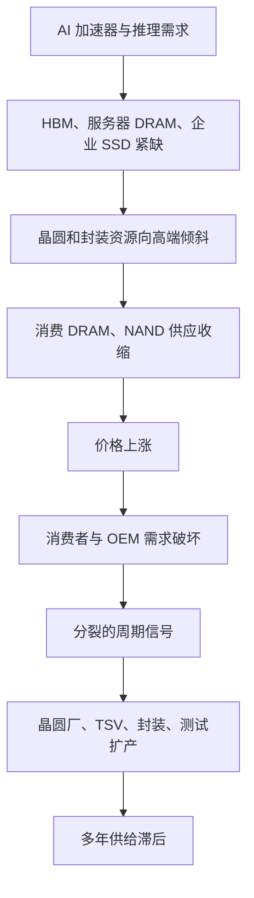

# 供需周期：为何 AI 存储紧缺而消费存储可能走弱

> [查看英文原文](../../10-macro-drivers/02-supply-demand-cycle.md)

存储周期一向剧烈：供给资本密集，需求周期性强，边际交易决定价格。2025–2026 年的特殊之处在于 AI 造成分化市场：HBM、服务器 DRAM、SOCAMM 类低功耗服务器模块和企业 SSD 紧张，而消费电子对涨价的承受力正在下降。因而不能将“内存短缺”理解成所有产品同幅度、同节奏短缺。

## 这是分裂周期，不是统一短缺

AI 加速器和推理需求拉高高端内存，厂商会把 DRAM 晶圆、TSV、封装和测试资源优先分给利润更高、认证更复杂的 HBM 与服务器产品。其副作用是普通 PC、手机、客户端 SSD 的可得性和价格也会受到影响，但消费端需求无法无限吸收涨价。消费 OEM 削减配置、推迟采购或把成本传向终端后，可能出现高端仍紧、低端去库存的并存局面。

## 价格信号及其局限

合约价、现货价与厂商评论是重要信号，却不是独立预测器。合约价通常反映已认证客户及季度谈判，现货价对库存情绪更敏感；HBM 的价格还混合了 die、堆叠、封装、测试、良率和认证价值。高端产品溢价上升，并不自动说明客户端产品也有同等健康的终端需求。

价格上涨也会触发需求破坏：PC 和手机 OEM 减配、延后建库或选择更低容量；SSD 买家会延迟升级或改用更低成本 NAND。若价格涨幅放缓，可能是供给改善，也可能只是消费者碰到可负担性上限。判断时应结合出货量、库存天数、晶圆投片、产品组合与客户预订，而不能只看单一价格曲线。

## 供给响应：为何需要多年

“存储涨价就扩产”在 HBM 时代尤不成立。新厂房、洁净室、设备安装、工艺爬坡和客户认证本身就需要多年；HBM 还需要先进 DRAM die、TSV、薄化、堆叠、键合、散热、KGD 测试和封装产能。一个环节的良率或测试时间不足，都可能限制可交付堆叠数。

厂商还必须在普通 DRAM bit 增长与 HBM 资源之间取舍。将晶圆投向 HBM 可提高收入和利润，但也会缩减可供其他 DRAM 的产能；反之，过度扩张通常在需求转折后压低回报。存储供应商经历过周期性亏损，因而更强调资本纪律。即便宣布新 fab、收购或封装线，实际有效供给通常在后续年份才出现。

## NAND：受 AI 拉动但仍脆弱

AI 增加检查点、训练数据、检索、向量数据库和推理持久层，对企业 SSD 与部分 QLC NAND 有真实拉动。不过 NAND 的供给弹性、客户端暴露度和产品可替代性往往高于 HBM。企业 SSD 旺盛，并不保证零售 SSD 或手机 NAND 同样紧张；若云厂商优化写入、延长 SSD 使用寿命或降低数据冗余，NAND 需求也会较快受影响。

因此需拆分看待：高端企业 SSD 受平台验证、控制器、固件与可靠性限制；而通用 NAND 更容易受消费需求、库存和价格影响。AI 是上行支撑，但并没有消除 NAND 的传统周期风险。

## 需求破坏与替代

当内存价格持续上升，客户会使用三类杠杆：减少容量配置、延迟采购、改变架构。消费端可由 16 GB 改回 8 GB 或降低 SSD 容量；数据中心可采用内存分层、压缩、量化、缓存优化或 CXL/SSD 外溢；AI 软件可以通过稀疏化、蒸馏和调度降低每 token 的热内存。此类效率不一定减少总需求——成本降低也可能扩大使用量——但会影响需求增速及最紧缺产品的附着率。

## 利润率、资本纪律与情景

高端产品组合使存储厂商利润率改善，但这不是纯粹的“价格周期”。HBM 的利润取决于良率、堆叠高度、认证和封装/测试成本；企业 SSD 取决于控制器、固件、验证与客户结构。投资者应分别追踪 bit 出货、ASP、单位成本、产品组合和资本开支，而非只看总营收。

| 情景 | 主要触发因素 | 存储读穿 |
|---|---|---|
| 基准 | AI 高端需求强，消费端温和 | HBM/服务器 DRAM 紧，普通品类更分化 |
| 牛市 | 推理快速增长、供给爬坡慢 | 预订延长，HBM、先进封装与测试溢价扩大 |
| 熊市 | AI 利用率、融资或电力交付不及预期 | 高端订单递延，消费需求破坏加剧 |
| 供给反转 | fab、TSV、封装有效产能集中投放 | 高端瓶颈缓解，价格和利润率承压 |

## KPI 观察清单

| KPI | 为什么重要 |
|---|---|
| HBM/服务器 DRAM 与消费 DRAM 的价格差 | 判断分裂而非统一周期 |
| DRAM 晶圆向 HBM 的分配 | 决定普通 DRAM 的隐含供给 |
| 先进封装、KGD 测试与 TSV 利用率 | 反映 HBM 的真实出货上限 |
| NAND 库存与企业 SSD 出货 | 区分 AI 拉动与客户端疲弱 |
| OEM 内存配置与终端出货 | 衡量需求破坏 |
| 供应商 capex、投产和认证进度 | 判断供给何时真正到位 |

结论是，AI 可以使高端存储在消费存储转弱时仍保持紧张；但紧张并非永久，也不能由一个现货价格数字证明。正确方法是按产品、节点、封装和客户资格拆开建模供需。

## 来源

原文的全部来源、日期及链接请见[英文原文](../../10-macro-drivers/02-supply-demand-cycle.md#sources)。
