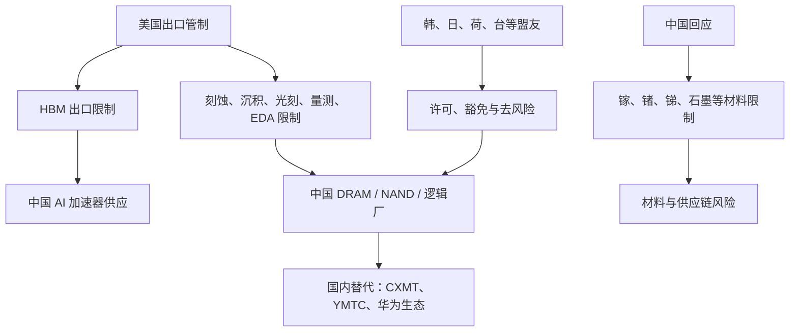

# 地缘政治与出口管制：存储作为战略卡点

> [查看英文原文](../../10-macro-drivers/03-geopolitics-export-controls.md)

存储已成为战略算力栈的一部分。AI 系统不仅需要 GPU 和定制加速器，也需要 HBM、服务器 DRAM、CXL、企业 SSD 和制造它们的设备。出口管制一方面直接限制 HBM 及半导体制造设备，另一方面通过改变全球厂商可建设、升级、认证和销售产品的地点而间接影响存储。2024 年 12 月美国规则把 HBM 及大量中国芯片企业纳入更严格控制，反映了 HBM 对 AI 工作负载的核心性。

## 管制逻辑

先进 AI 需要加速器；先进加速器需要 HBM；HBM 又依赖领先 DRAM 工艺、TSV/堆叠、封装测试和高度集中于美国、荷兰、日本、韩国及台湾的设备、软件和材料生态。通过控制成品芯片、HBM、设备、软件及服务，美国试图放缓中国同时获得高端芯片和建设本土制造能力的速度。

存储与逻辑的差异在于：中国可以在成熟和主流存储建立有意义产能，但 HBM 同时要求先进 DRAM die、3D 封装、测试、热设计及客户平台认证。管制不必阻止所有中国 DRAM，只要放慢能大规模稳定交付优质 AI 存储的关键环节，就会产生战略效果。

## 韩国厂商的中国 fab

全球供应链并不按国界整齐切分。三星在西安有大型 NAND 工厂，SK hynix 在无锡有 DRAM、在大连有 NAND 资产。年度设备许可可以让这些 fab 维持运营与维修，却通常不等同于不受限制的扩张；例如敏感设备和 EUV 仍受限制。

这带来政策权衡：过度阻断外资中国 fab 的工具流，会收紧全球 DRAM/NAND、推高美国及全球客户成本；允许过多，又保留了中国境内产能与全球工具链的连接。对厂商而言，许可续期、范围与时点直接影响良率维护、节点迁移、设备维修及产品组合。对市场而言，成熟 DRAM/NAND 的连续供给可以缓和消费市场，而 HBM 仍可维持受控状态。

## 中国替代

中国的 DRAM 和 NAND 替代已具可见度。CXMT 正发展 DDR5、LPDDR5X；YMTC 以 Xtacking 和本土工具推进 NAND。国产存储可首先服务中国 PC、服务器、工业系统、政府采购、客户端 SSD 与本地云，未必立刻取代国际厂商在顶级 AI HBM 的地位。其短期结果是双轨市场：本地常规产品供给改善，而顶级 HBM 与企业级认证仍较受限。

HBM 才是关键目标。DRAM 厂与具混合键合经验的 NAND 厂协作有其逻辑，因为 HBM 不只是 DRAM，而是 die、键合、热设计、测试和封装的组合。但这也显示难度：中国需让多个受约束、成熟度不同的生态同时达标；即使能生产有竞争力的 DDR5 类 die，在先进加速器平台上完成 HBM 认证仍是很高门槛。

## 材料反制与盟友卡点

出口限制会带来上游反制风险。镓、锗、锑、石墨等限制并非都专属存储，却会影响化合物半导体、光学、国防及广义电子供应链。战略格局不是单向的：美国及盟友掌握设备、软件、IP 和先进封装卡点；中国拥有规模、下游电子制造和部分关键材料杠杆。

管制能否持久取决于盟友协同。HBM 主要由韩国和美国供应，最先进光刻来自荷兰，多类材料和设备来自日本，先进代工与封装高度依赖台湾。各方目标并不完全一致：韩国关注中国 fab 连续性与本国厂商竞争力，日本关注材料/工具收入及安全，荷兰需平衡 ASML 商业利益与政策压力，台湾管理海峡风险与供应链安全。协同不足会造成漏洞，协同过严又可能抬高全球消费电子成本。

## 市场效应与管制边界

第一是供应碎片化：一种存储可在中国本地系统中合规，却不被全球 OEM、美国政府采购或超大规模 AI 集群接受；反之，领先 HBM 可能技术最佳却无法供给中国客户。由此价格、认证和渠道策略分裂。

第二是地理溢价：美国、韩国、日本、台湾、新加坡等盟友地区的 fab、封装和测试能力因较少受中国许可风险影响而更有战略价值。第三是替代压力：中国客户可能以国产加速器、较低带宽内存、更大规模低性能集群、量化、稀疏化、蒸馏和开放模型适应限制。管制通常最强于低替代性瓶颈（HBM die、TSV 集成、键合、高端检查/测试、先进 EDA/IP），较弱于普通 DRAM、客户端 SSD 等可替代或可受本地需求保护的产品。

因此应把管制建模为成本与时间楔子，而非绝对高墙。两年的 HBM 或先进 NAND 延迟仍可能在 AI 竞赛中十分重要；与此同时，管制也会催化库存前置、第三国转运、更多缓冲库存、合规成本和原产地证明要求。

## 对存储厂商的含义与 KPI

三星和 SK hynix 面临“溢价与运营风险并存”：高端 HBM 限制可能保护获批客户的配置，但中国 fab 需持续获许可，中国也是重要电子市场。Micron 的美国联盟产能与客户定位得到加强，同时也更易受到反制和市场准入摩擦影响。CXMT、YMTC 的机会并不要求立刻战胜 HBM4，它们可从中国 DDR5、LPDDR、客户端 SSD、政府采购、国内服务器及较低端 AI 系统获得学习与份额。

| KPI | 含义 |
|---|---|
| HBM 管制范围 | 决定中国能否直接获得高端 AI 存储 |
| 三星/SK hynix 中国许可续期 | 影响成熟 DRAM/NAND 连续性与全球供给风险 |
| 存储/设备企业 Entity List 增加 | 显示限制是否向产业链深处延伸 |
| CXMT DDR5/LPDDR 认证 | 衡量中国本地 DRAM 替代 |
| YMTC 工具本土化与 fab 爬坡 | 衡量 NAND 韧性 |
| 中国 HBM 样品与合作 | 测试 DRAM、键合能力是否会合 |
| 关键材料限制及盟友协同 | 捕捉反制与执行强度 |

基准情景是可控的碎片化：先进 HBM、AI 加速器和领先设备限制继续收紧，中国扩大主流存储并探索 HBM 替代。对存储数据库而言，fab 地理位置、出口司法辖区和客户资格已经必须纳入每个供需模型。

## 来源

原文的全部来源、日期及链接请见[英文原文](../../10-macro-drivers/03-geopolitics-export-controls.md#sources)。
